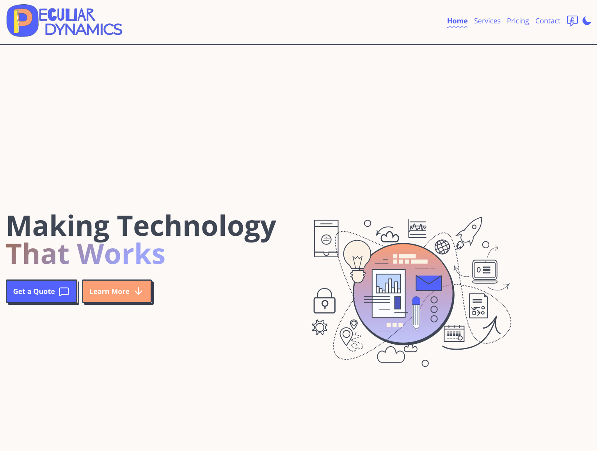

# Peculiar Dynamics Home



Accessible Astro Starter is a ready to use, SEO and a11y friendly blogging theme. It contains plenty of accessible components to build several page types, Tailwind CSS to help you build faster and example pages such as a dynamic Blog, 404, Markdown and MDX. This theme is designed to help you build your project faster and provide a solid base for accessibility!

This is the Peculiar Dynamics website repository, built using AstroJS, the accessible Astro starter template, ESLint, Tailwind CSS, and Google Analytics integration.

🚀 [Live Preview](https://peculiardynamics.co.uk/)

## Table of Contents

- [Introduction](#introduction)
- [Features](#features)
- [Getting Started](#getting-started)
- [Prerequisites](#prerequisites)
- [Installation](#installation)
- [Usage](#usage)
- [Configuration](#configuration)
- [Google Analytics Integration](#google-analytics-integration)
- [Credits](#credits)

## Introduction

This repository contains the source code for the frontend of the Peculiar Dynamics website, which is built using AstroJS. AstroJS is a modern static site generator that focuses on performance and developer experience. We've used the accessible Astro starter template as a foundation for our website, ensuring a solid starting point for creating an accessible and user-friendly web presence.

## Features

- AstroJS: Leverage the power of AstroJS to create a high-performance static website that delivers a seamless user experience.
- Accessible Starter Template: Start with an accessible template that lays the groundwork for an inclusive website design.
- ESLint: Maintain code quality and consistency across the project using ESLint, a popular JavaScript linter.
- Tailwind CSS: Utilize Tailwind CSS for efficient styling and design. Tailwind's utility-first approach empowers rapid development.
- Google Analytics: Gain insights into your website's performance and visitor behavior with integrated Google Analytics tracking.

## Getting Started

### Prerequisites

Before you begin, ensure you have the following software installed:

- Node.js: Download and install Node.js
- Git: Download and install Git

### Installation

1. Clone this repository using Git:

```bash

git clone https://github.com/your-username/business-website.git
```

2. Navigate to the project directory:

```bash

cd business-website
```

3. Install project dependencies:

```bash

npm install
```

## Usage

To start the development server and preview your website, run:

```bash

npm run dev
```

This will build and serve the website locally. Open your browser and navigate to `http://localhost:3000` to see the website in action.

## Configuration

Customize the website to match your business by modifying the content, styles, and images. The project structure is organized for easy navigation:

- /src: Contains the source code of your website, including pages, layouts, and components.
- /src/pages: Create new pages or modify existing ones.
- /src/layouts: Customize the layout structure of your pages.
- /src/components: Reusable components that can be used across multiple pages.

## Google Analytics Integration

Google Analytics is integrated into the website to provide insights into visitor behavior. To enable Google Analytics tracking:

1. Replace YOUR_GA_TRACKING_ID in the src/utils/ga.js file with your actual Google Analytics tracking ID.
2. The integration is already set up in the template, so data will be collected automatically.

---

## Credits

- Starter template: [Accessible Astro Starter](https://accessible-astro.dev/)
